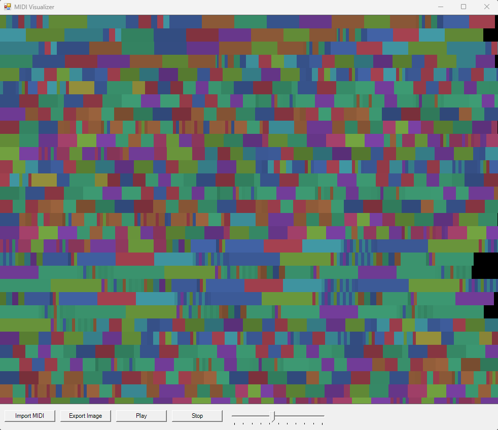

# MIDIVisualizer
This F# application can import, analyze, visualize, and play MIDI files.

How does it work?
- click on the Import MIDI button
- select a file with any .mid extension and click open

- The program will display a visual model of the file and you can adjust the color shift to your liking using the slider on the right. You can also save it as an image by clicking on the Export Image button.

- Click on the play button to play the midi file. You can then stop it by pressing the pause or stop button.

